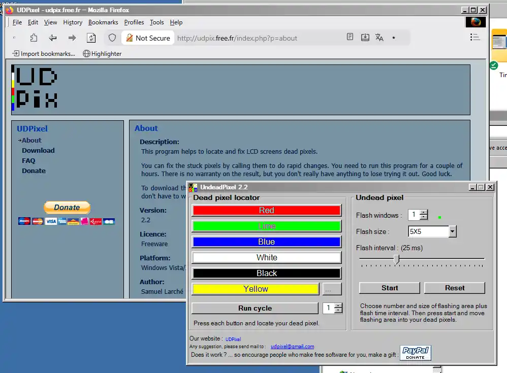
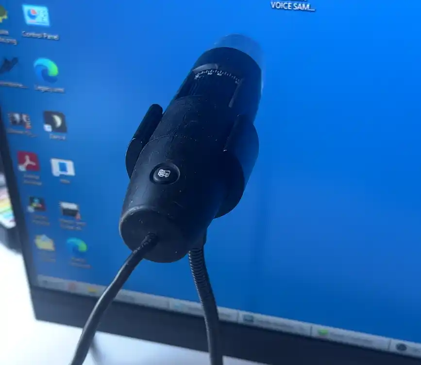
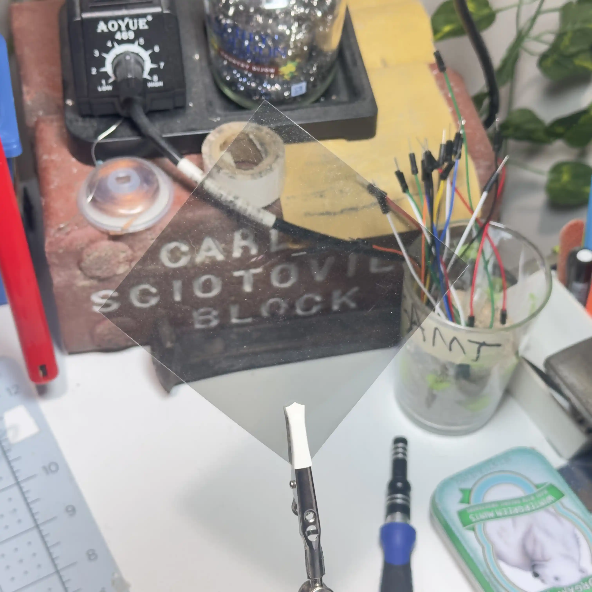
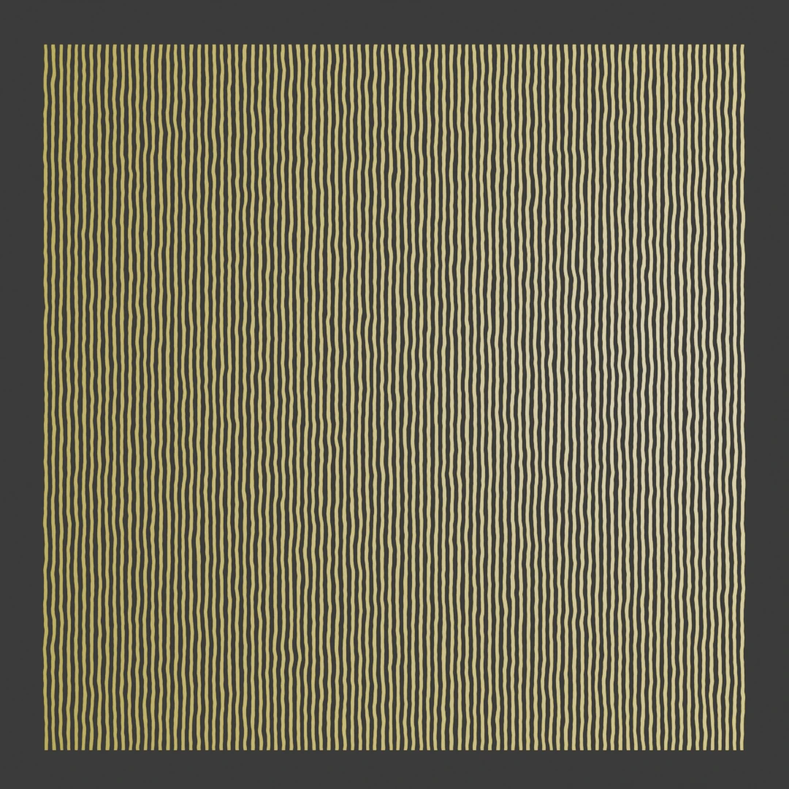
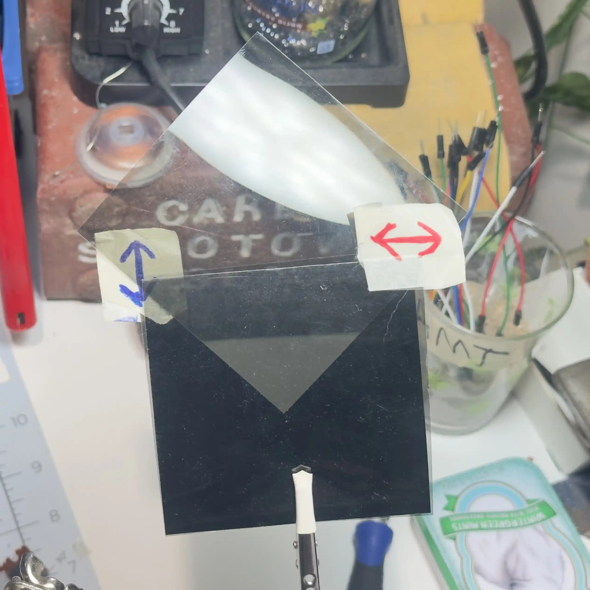
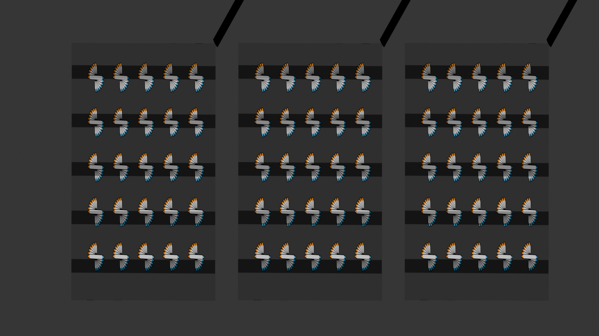
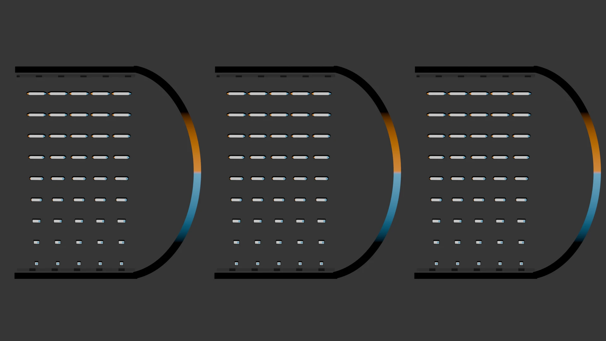

# My Dead Pixel (WIP)

Introduction

A couple months ago I got a new computer monitor! I was really, really excited; for two reasons: 

One, Because it’s a  color-accurate monitor so that hopefully I can make my videos look less terrible. 

(It's not that fancy, it's an ASUS PA248QV which is the cheapest Calman-verified monitor I could find. Despite everything you're about to read, I would highly recommend it! It's been great.)

And two: Because my old monitor has *pee* in it.

I mean, I say pee... three apartments ago it was in a closet, and our upstairs neighbor’s toilet broke. Some sort of offensively viscous fluid came down through the ceiling. I had to throw a bunch of stuff away, but like… I needed the monitor. I cleaned out all the pee that I could, and it works fine. I’m still using it as a second screen—it doesn’t smell or anything!

Anyways, the new monitor gets here, it’s great, I love it. And then one morning, I woke up to this:

I tried to wipe it off, but I knew in my heart right away what it was: a single dead pixel. And like, I know it's just one pixel out of literally two million, three hundred four thousand of 'em — but now it's the only thing I can see.

It's like someone took a shotgun to my brand new monitor. 

So, as an engineer, naturally my first response to something like this is to completely and utterly dispose of any critical thinking or problem solving skills. I googled "dead pixel fix Reddit", and found some posts and comments suggesting that you could flick or smush a pixel back to life in some cases.

But even deep in the throes of denial, I was still pretty hesitant to start banging stuff on the face of my new monitor, so first I went to the kitchen and grabbed a silicone straw. I tried sort of poking at the screen with it, and then eventually graduated to lightly whacking it. Obviously nothing happened. 

So I took a deep breath and tried with a pencil. First really gently, and then I got a little more desperate. None of it helped. I didn't really think it would; I guess I was just hoping I'd be lucky. And - you know - the world is complicated! Sometimes you  fix stuff by hitting it!

Typically this is stuff that has physical moving parts. The trick is knowing exactly where to hit, and how hard. Really, the trick is understanding whatever the f**k you're doing. Which I did not. 

But at this point I turned to a more technological approach, and downloaded some pixel-flashing software. Specifically this one, UDpixel—short for "Undead Pixel".

All it does is make a tiny flashing box. 

The idea is that you drag it on top of your problem pixel, and force it to cycle through different colors really quickly. It's kind of like poking it, in that it's trying to "unstick" anything that might be "stuck", but like... electrically. 

Honestly I'm doubtful this has ever worked; I think it might just be folklore. Regardless, I lined this up, and let it run for... hours. 

No dice. Still dead.

Then I remembered that years ago, my engineering mentor Ira gave me an old USB microscope. So in a flash of inspiration I hooked that up, mounted it flush against the monitor, and check this out.

Wicked cool, right? You can see all the individual pixels — and the red, green, and blue subpixels that make them up. It reminds me of being a kid and getting way too close to the TV. And look—there's the dead pixel. I filmed this with the flashing software running, so the dead pixel is trying really hard to change colors.

With the microscope, I could see specifically that the red and green bits were almost completely dark, while the blue one *almost* still works! But they are all only sort of... impotently flickering. And this is when the rabbit hole opened up underneath me. Because I realized that I don't actually know how this thing that I use every day works.

Like, what is *physically* going on inside the screen? Without knowing what is actually, physically happening how could I even begin to diagnose the issue? I needed to know what part of this system failed. 

How did he die? I needed answers.

What I didn't expect was that the inner workings of an LCD screen are...

**...Wicked Interesting.**

I got sucked in deep on this one. And I actually made something that you can download and play with! It's really really cool. But we have to lay some foundational knowledge for that "thing" to make any sense.

So - here's what's gonna happen in this video:

1. We're gonna define a few basic structures, like what a pixel is and the general construction of a monitor
2. Then we have to speedrun some basic theory about waves, light, and the concept of polarization. (Trust me, they're super cool and I'm going to explain them in a fun way that's really easy to follow ).
3. With those in our pocket, we can move on to answering a question I can't believe I never thought to ask before: What the f**k are *liquid crystals*?

And then we'll bring it all together, and explain exactly what's going on inside an LCD pixel — and I can show you the crazy thing that I built.

So there's our plan for the video! 

Oh -- and at the very very end we're going to have a memorial service for my pixel. You're invited. It would mean a lot if you can make it. 

We've got a funeral to get to — let's jump in.

------

## Defining Our Terms

The word **pixel** is short for "picture element". I can't believe I didn't know that before. "Pixel" actually has a lot of context-specific definitions, but we're only talking about LCD screens in this video, so in our context—this is a pixel.

We were looking at these a minute ago! The **resolution** of a display is the number of pixels it has. A very common resolution is 1920 by 1080. There are 1,920 pixels across, and 1,080 pixels up and down—a bit over  total. Which I guess is technically about 2 megapixels but nobody calls it that. My monitor is actually 1920x1200, so techically it is 1200p? But far more common is 1920x1080. This is the resolution of 1080p (importantly, the "p" does not stand for pixel -- it stands for "progressive scan" and we're not getting into that). 

Each pixel is made up of three **sub-pixels**: red, green, and blue. Each subpixel can change brightness between fully on and fully off. And that's it! 

Because they're so small, you don't really *see* the individual subpixels with your naked eyes. The light coming through the red, green, and blue bits all blends together. When all three subpixels are at full brightness, it's white; when they're off, it's black.

By combining different brightnesses of red, green, and blue — you can make just about any color the human eye can perceive. Maybe in the future I'll make a whole video about why that's true...



NEW VIDEO IDEAS: 01



 But for now just know that, basically, all you have to do is stick two million of these tiny color-changing RBG dots on a screen, individually control the brightness of their six million subpixels without mistakes *at least* sixty times a second, and whambo-bambo that's a pretty okay looking picture!

Note: We are absolutely *not* going to talk about graphics drivers or how the control logic for actually displaying a picture works. That's a layer of abstraction higher than we want to be. We just need to find a probable cause of death for my individual pixel.

We're going down to the component level.

Here's a question for you!

**Just knowing what you do now, how would *you* go about building a pixel?** Like, if someone in real life literally asked you to *make a pixel*, what would you do? 

What comes to my mind first is to get some translucent colored plastic sheets, and make a little three-compartment box with a red, blue, and green section, and stick a dimmable light behind each one. 

That would work! But it's hard to scale down. Even LED lights are pretty hot and power hungry, especially when you put a bunch of them close together. We *have* gotten really good at making tiny LED lights though, and actually -- that is pretty much how an OLED display works.

*But it's not how a liquid crystal display works.*

In an LCD, there is actually only one light source—the backlight.

In older displays, it might have been rows of compact fluorescent tube lights—but in modern displays it's a bunch of white-ish LEDs. There's actually a lot of cool stuff to talk about regarding backlights and color, but that'll have to be a different video.



NEW VIDEO IDEAS: 02



What's important right now is that: if there's only one light source in the back—the backlight—and it's always on—that means each individual subpixel must be able to like, open or close somehow to let more or less of the backlight through, right? How else would you be able to get different colors? Is that what the liquid crystals do somehow? Yes.

But the WAY they do it is really really clever. To understand it though, we have to speedrun some basic concepts about waves, light, and polarization.

------

## Wave Basics

Don't you dare click away now, just because I said *one* word that sounds dense — I promise this is really really cool, and wicked simple. 

**We're not gonna do any math.** 

We're going to do some demonstrations together and stuff, it's gonna be a good time. 



**BROLL: SLINKY FOOTAGE**



You might have done an experiment like this in high school physics class. Take a slinky, attach one end to something, and stretch it out a bit—and you can see waves in action. If you wiggle the end of the slinky left and right, you can create a little wave that travels along the slinky. You can also push and pull it, forward and back, and send a pulse along the length of the slinky that way.

It's a little harder to see, but you're creating an area of the slinky that's either bunched up or stretched out, and that oscillation moves down the slinky. That's how sound waves work—compressed and stretched regions of air. And that's called a longitudinal wave. A longitudinal wave is when the direction of the oscillations is in the same direction that the wave is traveling or propagating.

The first wave, where we went left and right, is called a transverse wave—because even though the wave travels in the same direction (down the slinky), the oscillations are *perpendicular* to the direction of travel. In this case, the wiggles go left and right, while the wave itself is going forwards. The wiggling direction is 90 degrees off from the direction it's headed.

Because we live in a 3D world, we could also shake the slinky up and down, and have the same result—another transverse wave. This time, the oscillations go up and down, but the wave is still moving forwards. 

And uh, that's polarization! That's it!

------

## Polarization

The "polarization" of a wave is just the spatial orientation of the wave's oscillations. Specifically—not the direction it's traveling in; the directions it's wiggling in. 

Only transverse waves really have polarization. Which makes intuitive sense, right? A longitudinal wave has oscillations in the same direction it's traveling, and it can only be traveling in one direction, so there just isn't another dimension to play with. Whereas with a transverse wave, you could be horizontally polarized—or vertically polarized—or any-angle-in-between polarized.

A transverse wave can even be *circularly* polarized. Take the slinky again, and if we move the end around in a circle, we create a wave where the oscillations are circular. Really, it's a spiral because the whole wave doesn't arrive at the same time. But if you measure a complete *cycle* of the wave, it plots a circle. This is a fun one, because if you think about it—the slinky is moving left, right, up, AND down at different parts of the wave. 

So in that way, circular polarization *contains* some motion in all directions—except the direction it's *traveling* in. It oscillates in every direction *perpendicular* to the wave's path forward through space.

This picture blew my mind. 

It's a little elastic string: on one side it's attached to a spinning motor that's making it whip around in a circle, creating a circularly polarized wave. Then there's that horizontal slot in the middle, preventing the string from going anywhere but left and right on the other side. That slot is essentially *filtering* the circular wave down to just the horizontal component.

It's such an intuitive way to think about it, right? The string is trying to go in a circle, and the slot prevents all the directions except left and right. Now we've got a *polarizing filter* that turns a circular wave into a linear one.

And guess what? **Light** is a transverse wave. 

Light is an oscillating electric field that is generating a perpendicular magnetic field, and because of some really cool physics that we can't get into right now—those two fields reinforce and sustain each other as they move through space.

We're not going to get any deeper about the nature of light itself because that would take a lot of time and I'm already worried about how big this video is becoming. What's important is that light from the sun is all jumbled up; it's a big soup of random polarizations in all different directions bouncing around.

Which isn't the same as circular polarization (because that's a specific spiraling motion), but it's similar conceptually, because an imaginary "beam" of sunlight does contain polarization in every direction. And we can filter light the same way we filtered that circular wave on the string... 

But you don't use a metal slot, you use a specially crafted piece of magic plastic to do it.

And I bought a dozen of them online for like three bucks.

------

## Fun with Filters



``

Check this out! This is a sheet of polarizing celluloid plastic. It's called a Polaroid sheet—and yeah it was invented by Edwin H. Land who then created the company Polaroid.

My little USB microscope can't do it, but if we could zoom in far enough you'd see that this sheet is made of really long chains of electrically conductive plastic, all oriented in the same direction.

Because of that, this material only lets light through if it's electric field is wiggling in the *opposite* direction as those long chains.



That might seem confusing because you'd think the slot is oriented the right way for the light to get through. If it was a string, that would make sense, right? But this is where the behavior of electricity starts to matter.



What actually happens is that if the light's polarization is in the same orientation as those conductive strands, they sort of act like antennas. 

Because they're conductive, as the light's electric field hits them, the electrons inside those strands can slosh up and down along the length, effectively absorbing the energy of the light and converting it into a tiny amount of heat from the electrons being moved.

However, any light that is NOT oriented in the same direction can slip through, because as those electric fields hit the strands, the electrons in the strands don't have room to wiggle in their shorter dimension. 

So the light wave passes through because nothing absorbed it. It slips through the slot. Just... sideways from the way you might expect. But that won't be super important, I just figured it was worth mentioning.

``



So this is a polarizing filter, a lot like the slot for the string -- but for light. It works a little differently at the particle level -- but the effect is pretty much the same.

All the light coming through it is only wiggling the direction that the polarizer allows through. That's also why it's slightly dim when looking through it!  Some light will be blocked by default.

Now check *this* out. The magic happens when you get more than one.

If I put another polarizer in front of it, it doesn't really get much dimmer.

Or at least it doesn't get as dim as I'd expect, given how dark a single one is. That's because the light coming through the first one is already polarized in the correct direction to slip through the next one, so there's no additional light being blocked by the second filter, really.

But watch what happens when I rotate one of them 90 degrees. 

Now, you can't see through it at all!

Think about what's happening: let's imagine the string again. If we've got a horizontal slot, and we add another horizontal slot in front—no big deal! If we rotate that slot 90 degrees, now we've restricted the string from wiggling in any direction. 

We've just done that, but with light!

I'm gonna add pieces of tape with little icons so we can tell which orientation each filter is in. Now look at what happens if we slowly rotate one of them. It fades slowly from dark to transparent. The closer you get to aligning the filters in the same orientation, the clearer it is. The closer you get to being perpendicular—the more light is blocked and the darker it gets.



BROLL: ROTATING POLARIZERS



Stick this in front of a light source, and you have an adjustable, physical brightness control, yeah? 

And I swear we are almost ready to talk about how an LCD pixel works. But we can't just shrink this down to the size of a pixel. It would require building really intricate, tiny, precise machines on each individual subpixel to rotate tiny little filters, and that would be prohibitively complicated and really easy to break.

So they do something really clever instead. We just have to get through one more bit about polarization.



SOME KIND OF TRANSITION



If I take our brightness control we just built, we know that on either end we can be aligned and let through as much as possible—or we can be perpendicular and block all the light from going through.

But we can also stop it halfway—so that the second filter is 45 degrees off from the first filter—and it ends up being about half as bright. That makes an intuitive kind of sense, but we need to talk about what's actually happening.

Let's think through it step-by-step, from one end to the other. Raw, unpolarized light hits one side of the first filter. It only lets through the vertical components of that light, so now we've got vertically polarized light headed towards that second filter.

It's intuitive what would happen if the next filter was horizontal. It'd block our path because then we can't move up and down at all. But the second filter is 45 degrees off. What happens now?



MAYBE WHILE DRIVING, MAYBE DO A DIAGRAM



Imagine you're driving a car --

Wow we're like three meta-explanations deep at this point. Just ride it out, I promise it's worth it --

Imagine you're driving a car, and you're headed along a road that goes due North. As time goes on, you will end up farther North, right? What if the road was going Northeast? In the same amount of time, you'll end up going half as far North—and half as far East.

North and East are perpendicular to each other, and your motion is somewhere in between. Unless you're headed perfectly in one of those directions, some **part** of your motion will have to exist in both of those directions.

You're moving *some amount* East and some amount North. The more aligned with North you are, more of your motion is in that direction, and vice versa.

Let's zoom back out—because that's exactly what's going on with our light polarization here. We have our vertically polarized light approaching this 45-degree slot. Because the slot is at a 45 degree angle, there is some "up and down" to it. There is a vertical component to this angled slot. So *some* of our vertical energy will get through, and in this case because it's splitting the difference between vertical and horizontal—it's about half as bright.

As you rotate the second filter closer to being horizontal, it cuts off more and more of the light—because that vertical component gets smaller and smaller. Once you're going fully East, you have no motion in the North direction; once the second filter is fully horizontal, it won't let through any vertical energy.

There's no room to wiggle in that direction anymore. Similar to our string-in-a-slot picture from earlier!

I hope that made sense because otherwise this next bit is gonna look crazy. If I take our two filters, and make them perpendicular to one another so that they block all the light—but then I stick a third filter in between them at a 45 degree angle... suddenly you can see through it. The first filter is vertically polarized, the last filter is horizontally polarized, so you'd expect that to block out all light—but having that 45 degree filter in the middle makes it see-through again.

How?!

It's the same thing we just described! Follow the light from one end to the other. 

First we have unpolarized light. Then it goes through the vertical filter, and we isolate just the vertical components. The light is now all vertical. 

From there, it hits the next filter — the diagonal one — and that lets through part of the light. Whatever vertical component of that angle exists —however much "up and down" there is in the angle of that slot — gets through. 

Now it is polarized in the diagonal direction of that slot, which means the final filter is actually just another 45 degree angle off. Because of that, we again lose **some** energy — but there is a component of our polarization that is in the correct orientation, so that light passes through.

Don't worry if this is a little hard to follow. There's not gonna be a test.

Here's an easier way to picture it intuitively: imagine you stacked a bunch of polarizing filters in a gradual rotation from vertical to horizontal. Each one is just a few degrees rotated from the one before it. Individually, each filter passes **most** of the light it receives, since it’s only slightly misaligned with the one before it. 

As it moves through the stack, **most** of the light is in the right orientation to pass through the next filter, then the next filter, and so on. The stack "rotates" the polarization smoothly from vertical to horizontal—like a staircase of polarization. And at the end, the light is aligned with the final filter, so most of it gets through. 

The more steps you use, the more efficient it can be. If you had an infinite amount of filters and each was rotated just an infinitesimally small amount—you could theoretically rotate the polarization without losing any of the brightness along the way.



HARD CUT



Wow. That's a lot of ground we just covered really fast. 

If you made it this far, why not hit the like and subscribe buttons? You deserve it.

Alright so - what does all this have to do with pixels? Do they have some kind of infinite filter staircase inside them, and they control their brightness by twisting and untwisting it or something?

...Yeah, kinda!

------

## Liquid Crystals

Liquid. Crystals.

Crystals... but make it liquid? 

So like... this:



IMAGE OF A CRYSTAL



But drinkable? Oh god can you imagine...

Let's not give that crowd any ideas.

Anyways, stick all that stuff we just learned about polarization in your back pocket—and let's talk about what liquid crystals actually are!

We'll start with the "crystal" part.

 For something to be a crystal, it has to be made out of atoms or molecules arranged in a repeating, orderly pattern that extends in all directions. When you have a large object that is made entirely of these perfectly organized molecular structures, you get something like the big pointy crystals in this rock here.



MY COOL QUARTZ ROCK GOES HERE



Each of those big points is a mono-crystal. All the atoms in one of these points are perfectly slotted together in a repeating pattern. Because all of the atoms that make it up are so perfectly organized—you end up with these nice sharp edges, flat faces, and generally hard-edged geometric patterns.

And then if you look at the bottom part, this is a poly-crystal. It's made of many smaller crystal chunks that all have fused together into a single object. You can see all the little crystal faces if you look closely. Each one of those little chunks is a perfectly ordered mono-crystal—but it's tiny and jammed up against a bunch of other tiny chunks—and they aren't lined up with each other. 

So this thing's got monocrystals on top, polycrystals down bottom. Business in the front, party in the back.

It's a very cool rock.

So to be a crystal is just to have a perfectly ordered repeating molecular structure. A lot of metals are crystals, salt is crystals, loads of stuff is crystals.  And crystals, by nature of their cool, perfectly-repeating organized structure, do have some special -- dare I say *magical* -- properties. Particularly when that repeating structure *isn't the same in every direction*.

Being perfectly ordered and repeating isn't the same as being symmetrical!

Look at these! They're hot glue sticks. And if we take a bunch of them and stack them up like this, we get a perfectly ordered pattern that we could keep repeating in all directions.



HOT GLUE STICK DEMONSTRATION SEQUENCE



Looking from the front you could easily keep doing this up, down, left, or right—and looking down from the top you could stack another one of these right in front, or even stagger the layers—as long as you do it evenly.

So this is like a crystal structure: it's perfectly ordered and repeats in all directions—but it's made out of these **rod-shaped** building blocks, so it isn't *symmetrical* in every dimension. Looking at it front-on: you have these small circular ends, and looking at it from the top down: you have long rod-like structures.

There's a sciencey word for when something is different depending on the direction you're coming at it: **anisotropy**. Which I might still be pronouncing wrong. It's the opposite of "isotropy". "Iso" meaning "equal" and "tropy" meaning "turn" or "way". "Equal way" I guess, which kind of sounds like an MLM. 

Something is isotropic if it is uniform in all orientations. An-isotropy is the opposite—not uniform in all orientations. From Wikipedia: "An anisotropic object or pattern has properties that differ according to direction of measurement"



BROLL: VIDEO GAME SETTINGS MENU



If you're a pro gamer like me, you've probably seen "anisotropic filtering" in the graphics settings of various games. What that setting does is change the way textures are displayed based on the orientation you're looking at them from - but that's a whole different video I could make



NEW VIDEO IDEAS: 03



Think about something like wood—it's way easier to split wood along its grain than it is to break it against the grain. Intuitively that makes sense right? You're prying apart the layers of those wood fibers, versus trying to break the fibers in half. 



MAYBE BREAKING WOOD IRL, OR JUST HOLDING SOME IDK



So wood is easier or harder to break apart depending on which way you try to do it. That's anisotropy, baby!

Back to our gluestick block—which we've established is anisotropic—we're not concerned with trying to break this apart. Instead I want to tell you what these gluesticks represent. 

I bet you can guess.

This is my low-tech model of liquid crystal. 

Just to make everything more confusing — "liquid crystal" is actually a state of matter, like solid, liquid, gas, or whatever. The actual compound that's used in liquid-crystal-form can vary but I'm not going to get into that. I just want to get that out of the way, because I'm probably going to accidentally refer to this as "a liquid crystal" in the rest of the video and you're just gonna have to forgive me.

The liquid crystal used in an LCD screen is made out of rod-like molecules — just like our gluesticks here. And due to the nature of that rod-like shape, the molecules tend to **self-align into a crystal structure**. It's just the easiest way for them to be at rest.

Check this out, it's wicked cool.



LIQUID CRYSTAL SELF-ARRANGEMENT DEMO



If I jumble them all up so the rods are all in different orientations, and then shake it, you'll see they all naturally settle into that pattern we had before. For the most part. 

This makes intuitive sense, right? They're not gonna wanna stand up on their tiny ends; they're gonna fall onto their long side. As they fall down, they slot into the gaps between each other and form this nice, ordered, layered, crystalline structure. 

So liquid crystal is a bunch of rod-shaped molecules that are together in a loose, liquid state—but self-aligning such that they form a crystalline structure kinda by default.

How awesome is that??

We have a liquid that can flow, be squashed, stirred, or otherwise manipulated, and it returns to an ordered crystal state at rest. That crystal state is anisotropic, so—just like the gluesticks—it's got different properties based on which way you're looking at it.

Now, remember all that talk about polarization? Specifically how the polarizing filter sheets are made of "really long chains of conductive plastic, all oriented in the same direction".



LOOK STERNLY AT BLOCK OF GLUE STICKS



Yup. Liquid crystal can behave sort of like a polarizing filter — the way it interacts with light is different based on whether the light’s vibration is along the rods or across them. It's a little bit weirder though. Unlike the polarizing filter, it's not able to absorb or block any light itself.

The plastic filter *blocks* the light by converting the light's electric field into heat - because it's made of those long, conductive chains. Liquid crystal isn't electrically conductive in the same way.

Without getting too far into it -- or at least too-er farther-er into it than we already are -- Like the plastic filter: light that is already polarized perpendicular to the long axis of the liquid crystal rods passes right through. 

But unlike the plastic filter, light that is polarized parallel to the rods just gets *slowed down*, rather than absorbed and turned into heat. 



CUT AWAY



If that's confusing, don't worry. You'll find out in a minute that this little tidbit isn't super important in the context of a liquid crystal display. I'm dancing on the lid to a huge can of worms, and I really don't want to open it. But if I just said "liquid crystal is a polarizing filter just like the sheet" I would upset any optics nerds watching. They're probably already mad I haven't said the word "birefringence" yet. There you go, you little freaks.

Just... trust me, this will all make sense very shortly. Let all this crap percolate in the back of your brain while you watch the funny moustache guy get more and more desperate to be understood.

Anyways.

___

## Polar Molecules

There's just one last, tiny bit of info you need before we can fully deconstruct what happened to my pixel.

Those rod-shaped liquid crystal molecules are polar—meaning one end of them is slightly electrically positive, and one end of them is slightly electrically negative.

Again that doesn't mean they're conductive - everything *has electrons*. Something being conductive is more about how easily those electrons can **travel**. In this case, of one end of the molecule simply has **more** electrons than the other end, and because electrons are negative charges that end is slightly more negative than the opposite one.

Importantly, this means we can use an electric field to push and pull on them. To move them around!

Think of it like magnets. If each rod-like molecule is like a little magnet with a positive and negative end—and you stuck a big powerful magnet above it, the molecules are going to move around and try to orient themselves with that magnetic field.

Let's say the bottom of the big magnet is positive. All the positive ends of all the little molecules will be repelled, and the negative ends will be attracted, right? Right.

Same thing, just electric fields instead of permanent magnets.

So— to recap, liquid crystal is made of rod-like molecules which naturally settle into a nice little ordered lattice when they're at rest. They affect the polarization of light passing through them by slowing down anything perpendicular — AND you can pull on them with an electric field to make them physically move and rotate whatever direction you want. 

Got that? Because THIS is where it ALL COMES TOGETHER.

It's time to show you the thing I made. I spent *many* hours in Blender's "geometry nodes" to make an interactive pixel we can play with.

___

## How an TN TFT LCD Screen Works

So let's do it! Let's build ourselves a pixel. Specifically, a TFT TN LCD pixel.

That's "thin film transistor, twisted nematic, liquid crystal display" pixel. Don't worry about it. It will all make sense later.

We know a single pixel is actually made up of three subpixels - one red, one green, and one blue - and that we can get the full range of colors just by blending different amounts of those, which we do by adjusting the brightness of them independently. Because they're really small, we don't see the subpixels, just the mixed-together light.

We can take care of the actual *color* part just by sticking a translucent colored sheet over the top. Bingo, that's easy! I mean, it *is* really really small, but there's nothing fancy going on. Just colored plastic.

Now we need a way to independently control the brightness of each subpixel so we can mix our colors properly. 

Remember an LCD screen only has one actual light source - the backlight - and it just stays on. Solid white light is continuously blasted outwards from the back of the monitor -- so instead of varying the light source itself, we have to control how much light passes through our subpixel by *filtering* it.

Earlier we saw how you can create a variable dimming filter by rotating two polarizers. When they're perpendicular they're almost totally opaque, when they're parallel they're almost clear, and as you move between those extremes you get a smooth transition of brightness.

But we need two *million* pixels for a 1080p display, which means *six million* subpixels -- and it would be completely insane to try something like building six million little motorized filter-twisting robots inside the screen. Trying to rely on rigid, mechanical moving parts is a recipe for disaster. So we can't just use two rotating filters to make our pixel.

Instead, we do something really really clever.

Let's imagine this from a side view. The backlight is at the very bottom, blasting upwards through our pixel and out the screen. We're going to build a stack of components that this light has to pass through, which will allow us to change the brightness exiting the top.

First, we put a polarizing filter. The exact orientation isn't important but I'm gonna call it "vertical" for this explanation. So now, all the light passing upwards through our pixel is vertically polarized instead of the scattered, random polarization from the backlight.

Leaving the middle empty for now, we're going to put another polarizing filter right at the very top, just before the light exits the screen. This polarizer is going to be perpendicular to the other one, so in our case it will be horizontal.

Yeah, perpendicular. So that it blocks ALL of the light coming through. If we stopped now, we'd have a black screen that doesn't do anything except waste electricity.

But I bet you have a hunch where this is going...

We're going to fill the space in the middle with liquid crystal - but there's a trick. And it's surprisingly low-tech and physical.

The liquid crystal is sandwiched between two very, very thin glass plates. There's a plate at the top, screen-side; and a plate at the bottom, backlight-side. The inner surfaces of those plates have tiny grooves or channels in them. The grooves are actually created by coating the glass in a thin plastic film, and then passing a fast-spinning velvet-covered roller over them, which scratches the surface to create these microscopic parallel grooves oriented in a single direction.

Remember how liquid crystal molecules are rod shaped, and that's part of how they self-organize into a crystal structure? Well these grooves serve as little guides, to orient the liquid crystal in a specific direction. You pour the liquid crystal on top and they literally just fall into the grooves, which sets up the rest of the stack to form in that orientation.

The plate on the bottom, just above the vertical polarizer, has its grooves in the "vertical" direction to match. The plate on the top has its grooves in the "horizontal" direction, just like the horizontal polarizer above it. 

When we add in the liquid crystal, the bottom layer starts settling into those grooves vertically, while the top layer settles into the horizontal grooves. Because of its fluid nature, this makes the crystals in-between form a twisting spiral from bottom to top which gradually rotates 90 degrees.



``



Remember how we talked about 'rotating' the polarization? We took two perpendicular polarizing sheets - which blocked the light - and then slid a third one in the middle at a 45 degree angle, and suddenly we could see through it again, because now as light passes through each one in turn it has SOME component in the right orientation to get through.

If we add more filters at angles in between, it gets even brighter because as the light passes through each one, it's closer to the correct orientation for the next one. If we had infinite filters we could make a smooth twisting gradient that lets through almost all of the light entirely.

Remember I even said:

> *what does all this have to do with pixels? Do they have some kind of infinite filter staircase inside them, and they control their brightness by twisting and untwisting it or something?*

Voila! Instead of plastic filters, it's liquid crystal. That's the "TN" part I mentioned earlier - "Twisted Nematic".

Don't worry about what "nematic" means.

The important part is that we have a very, very gradual twisting "staircase" that essentially ferries the vertically polarized light up through the crystals, rotating gently as it progresses, until the light is in the right polarization-orientation to pass through the top filter!

If we stopped now, we'd have a screen that is all white because we've allowed all the light to pass through.

So the final key to the puzzle is gonna be adjusting the brightness, and we do that by twisting and untwisting the crystals. This is where that bit about liquid crystal molecules being *polar* comes in. Since they can be affected by electric fields, we place a  at the top and bottom of the subpixel.

I have no idea how the f**k we figured out transparent electrodes. Apparently it's usually Indium Tin Oxide (ITO), which conducts electricity but is transparent in thin layers.

At rest, without any electricity applied to the electrodes, everything sits how you see it now. They naturally fall into this smooth twist, guided by the grooved plates on the top and bottom. When we apply a voltage to the electrodes, one of them becomes positively charged, and one of them becomes negatively charged, which pulls on the crystal molecules -- forcing them to try and align with the electric field rather than their resting state.

Because the electrodes are at the top and the bottom, this makes the crystals try to stand upright. The positive ends are drawn towards the negative electrode, and the negative ends are drawn towards the positive electrode. This force is stronger than their natural internal friction, so they move.



``



This f**ks up the spiral, so now the light entering the bottom is horizontally polarized, passes through the crystals - but doesn't get neatly twisted, and is mostly blocked by the vertical polarizer up top.

If we're really careful about how much voltage we apply, we can disturb the spiral a little bit less. This results in some of the light getting twisted, and some of it not. Which makes the brightness vary depending on how messed up the spiral is. The more you disturb the spiral, the less light gets through.

Vary the voltage, you vary the spiral-ness, which varies the brightness, and hot diggity dog we've built ourselves a subpixel where the only moving parts are liquid! This is also why you see weird artifacts when you smush the screen. Part of that phenomenon is actually called "viscous fingering" which I think is hilarious.

You might be wondering "okay so where's the bit that controls the voltage". There's a lot of infrastructure hiding in the black horizontal lines that you can see in between rows of pixels. That's called the "black matrix" and that's where they tuck the wires and a single transistor for each subpixel.

I'm not going to explain those parts in the same excruciating detail as everything else, but it's important to note that the transistor is the thing which controls the voltage on the electrodes. Its job is to receive a signal, and then provide the right voltage to the electrode, which twists the crystals and adjusts the brightness yadda yadda.

The transistors for each subpixel are micro-printed on a big sheet that spans the entire screen, and that's what the "TFT" or "thin film transistor" part I mentioned earlier was referring to. They're super important! It's just that the specific electronics of it all is way too much to include in this video.

Maybe a future one...



NEW VIDEO IDEAS: 04



Okay It's almost time for the funeral, but real quick I want to tell you a couple fun facts now that we have the basic ideas out of the way.

If you've ever had an older LCD computer monitor where it looked like trash if you were even slightly at an angle - it was probably a TN or "twisted nematic" display that works exactly like we just laid out.

The reason they look bad from an angle has to do with the fact that the crystals are forced to stand more or less upright to dim each subpixel. Think about how they're all little rods -- if you look at a screen from an angle you're gonna be seeing partially through the sides of them, and that is gonna mess with the balance of light coming through.

If we wanted to avoid that, we could design a screen where instead of the rods twisting upright to break the spiral, we simply had them rotate horizontally. That way we're always looking straight-on at the long sides of the rods, instead of at their ends or odd-angles.

So, uh... we did that. Instead of electrodes on the top and bottom, we put one on  - left and right. Now when we apply a voltage, we twist the liquid crystal in the same plane instead of three-dimensionally. Because the crystals never stand up to point at you, the image looks the same from any angle. That's called "In-Plane Switching" or "IPS", and that acronym has actually made its way into the marketing world so maybe you recognize it!

There's a little more to how IPS works that I don't have time to get into. The electrodes aren't really "on each side", they're made into an interlocking comb shape to evenly distribute the electric field. It doesn't use the same spiral shape. Instead the whole block of crystals are oriented in the same direction, and the whole thing gets rotated 45 degrees - but I'll have to actually explain "birefringence" to really get into it, and I'm tired.

Newer screens, including your phone screen and probably most LCDs you encounter, are IPS. It's a little more complicated to manufacture, but it's basically better overall. It used to be that the IPS twisting and untwisting wasn't as quick as a twisted nematic configuration, meaning that you couldn't achieve very high refresh rates - you couldn't change the picture as fast because the pixels took more time to rearrange themselves. 

But we cracked that nut. I mean, not me personally, obviously, but manufacturing tech is crazy and we figured it out. Now IPS is everywhere and we're all better off for it.

In fact, my monitor is an IPS display. My dead pixel is an IPS pixel. This was his way of life.

___

## An Autopsy



WHILE PUTTING ON A FUNERAL SUIT



So what *did* happen to my pixel? What was the cause of death?

There's two ways pixels usually die. Either stuck open, always letting light through and creating a "hot" pixel that never changes or dims; or stuck closed, creating a "dead" pixel that stays black.

Can smushing or flashing *ever* fix a dead pixel?

Maybe. 

Anecdotally, people have sworn by both methods. In either case, they only really work if the problem is the liquid crystal itself becoming stuck. Smushing could physically move the crystals out of a stuck position and back into fluidity, and flashing would try to do the same except by forcing the electrodes to rapidly change voltage in hopes that electric yanking would have enough force to unstick them.

But what happens more often is that the control transistor breaks. No amount of squishing can fix that.

In a twisted-nematic screen, when there's no voltage the pixel is white. Remember how the spiral, at rest, twists the light to let it through? IPS screens are typically the opposite. They're normally black at rest, and when the voltage is applied it aligns the crystals to let light through. Without voltage, they're closed.

Now, the transistor can fail in two ways. It can either fail "open", meaning it no longer conducts electricity and thus provides no voltage to the electrodes -- or it can fail "short", literally shorting out and *always* applying a voltage. Depending on your type of screen this would change whether your dead pixel is "hot" or not.



VERY OUT OF PLACE "HOT OR NOT" GRAPHIC



Here's my best guess as to what exactly happened.

My screen is IPS, and the pixels are black when there's no voltage. In the microscope, we could see that the red and green subpixels are barely flickering while the blue one seems to be working. My best guess is that the transistors on the red and green subpixels have almost totally failed open, but are leaking just a little bit of voltage fluctuation through - hence the slight flickering.

Which means there's no amount of squishing or flashing that will bring him back.

It's time.

We gotta go or we're gonna be late.

___

## The Funeral



IDK exactly what's gonna happen here. My lofty goal is to make a little pixelated icon version of myself and some other people and literally drag/drop us around the dead pixel while filming the screen.



Hey. I'm glad you could make it. Sit down, the computer is going to say a few words. Shhh...

We are gathered here today, bathed in the soft glow of the backlight, to bid a final, tearful farewell to a tiny, yet significant friend. 

We are here to honor the life and service of Pixel X: 488, Y: 582.

To the unobservant eye, 488, 582 was merely a speck—one of two million siblings on a 1080p panel. But to us? To us, he was a soldier of the spectrum. A dedicated worker that resided in the upper-left quadrant, just slightly off-center. A prime location for displaying the first paragraph of an email, or the left eye of a protagonist in a movie close-up.

Let us remember 488, 582 for how he lived, not how he died.



BLACK AND WHITE MONTAGE OF CLIPS



He gave us Red: When we played games and the health bar was critical.

He gave us Green: When we were trying to figure out how to compo

And even in passing, he gave us Blue: When we stared at the default Windows wallpaper, contemplating our existence.

For months, 488, 582 changed state sixty times a second. He never complained. He never asked for a break. He simply asked, "What hex code shall I render?" and he delivered that code with brightness and fidelity.

If 488, 582 had been located at X:1900, Y:10, maybe we wouldn’t be so heartbroken. We could have ignored him up there in the corner, hidden by the "Close Window" button.

But no. Fate is cruel. At X: 488, Y: 582, he sat right in the middle of the action. He was a stumbling block for our eyes. We remember the denial stage, don't we? We remember thinking it was just a piece of dust.

"It's just a smudge," we whispered, frantically rubbing the screen with a microfiber cloth.

But the smudge did not move.

We tried the flashing seizure-inducing software. We tried the "pencil eraser massage" technique. We prayed to the gods of LCD and IPS. But 488, 582 had already crossed the over into the realm of permanent #000000.

And so now, we must accept this dark spot in our lives. We must learn to look past it. To scroll the page just slightly down so that the text isn't obscured by the cold, black void.



DRAGGING THE DIGITAL TOMBSTONE INTO PLACE



Farewell, 488, 582. You have fought the good fight. You have rendered your last frame. You have returned to the manufacturing void from which you came.

May your sub-pixels rest in eternal peace.

Ashes to Ashes, Dust to Dust, RGB to Black.

...

Thanks for watching.
